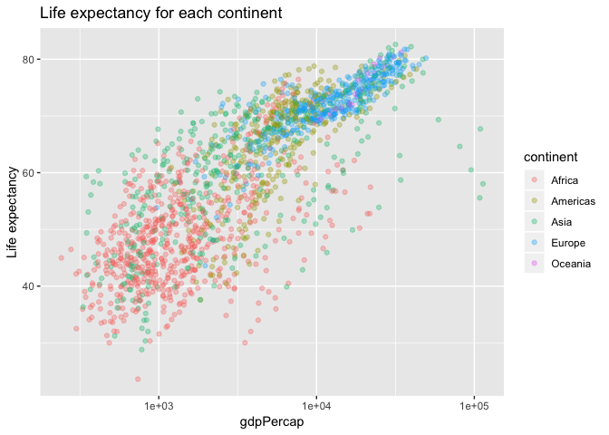
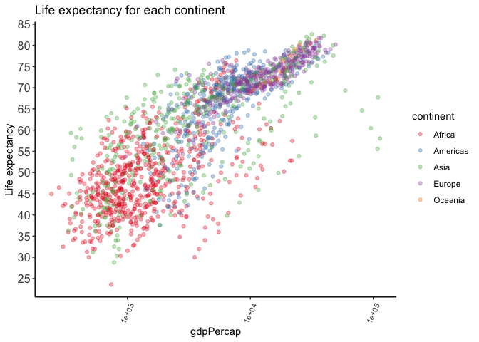

hw05 Factor and figure management
================

``` r
suppressPackageStartupMessages(library(tidyverse))
suppressPackageStartupMessages(library(gapminder))
suppressPackageStartupMessages(library(scales))
suppressPackageStartupMessages(library(plotly))
```

``` r
library(tidyverse)
library(knitr)
library(gapminder)
library(scales)
library(plotly)
library(ggplot2)
```

### Part 1: Factor management

Before we start the work, we need first check the data and we can see that `country` and `continent` variables are factors

``` r
summary(gapminder)
```

    ##         country        continent        year         lifeExp     
    ##  Afghanistan:  12   Africa  :624   Min.   :1952   Min.   :23.60  
    ##  Albania    :  12   Americas:300   1st Qu.:1966   1st Qu.:48.20  
    ##  Algeria    :  12   Asia    :396   Median :1980   Median :60.71  
    ##  Angola     :  12   Europe  :360   Mean   :1980   Mean   :59.47  
    ##  Argentina  :  12   Oceania : 24   3rd Qu.:1993   3rd Qu.:70.85  
    ##  Australia  :  12                  Max.   :2007   Max.   :82.60  
    ##  (Other)    :1632                                                
    ##       pop              gdpPercap       
    ##  Min.   :6.001e+04   Min.   :   241.2  
    ##  1st Qu.:2.794e+06   1st Qu.:  1202.1  
    ##  Median :7.024e+06   Median :  3531.8  
    ##  Mean   :2.960e+07   Mean   :  7215.3  
    ##  3rd Qu.:1.959e+07   3rd Qu.:  9325.5  
    ##  Max.   :1.319e+09   Max.   :113523.1  
    ## 

``` r
str(gapminder)
```

    ## Classes 'tbl_df', 'tbl' and 'data.frame':    1704 obs. of  6 variables:
    ##  $ country  : Factor w/ 142 levels "Afghanistan",..: 1 1 1 1 1 1 1 1 1 1 ...
    ##  $ continent: Factor w/ 5 levels "Africa","Americas",..: 3 3 3 3 3 3 3 3 3 3 ...
    ##  $ year     : int  1952 1957 1962 1967 1972 1977 1982 1987 1992 1997 ...
    ##  $ lifeExp  : num  28.8 30.3 32 34 36.1 ...
    ##  $ pop      : int  8425333 9240934 10267083 11537966 13079460 14880372 12881816 13867957 16317921 22227415 ...
    ##  $ gdpPercap: num  779 821 853 836 740 ...

#### Drop Oceania

Filter the Gapminder data to remove observations associated with the continent of Oceania. Additionally, remove unused factor levels. Provide concrete information on the data before and after removing these rows and Oceania; address the number of rows and the levels of the affected factors.

To drop Oceania, we can use `apply` function to filter the entry

``` r
gapminder_without_oceania <- gapminder %>% 
  filter(continent != "Oceania")

str(gapminder_without_oceania) %>% 
  knitr::kable()
```

    ## Classes 'tbl_df', 'tbl' and 'data.frame':    1680 obs. of  6 variables:
    ##  $ country  : Factor w/ 142 levels "Afghanistan",..: 1 1 1 1 1 1 1 1 1 1 ...
    ##  $ continent: Factor w/ 5 levels "Africa","Americas",..: 3 3 3 3 3 3 3 3 3 3 ...
    ##  $ year     : int  1952 1957 1962 1967 1972 1977 1982 1987 1992 1997 ...
    ##  $ lifeExp  : num  28.8 30.3 32 34 36.1 ...
    ##  $ pop      : int  8425333 9240934 10267083 11537966 13079460 14880372 12881816 13867957 16317921 22227415 ...
    ##  $ gdpPercap: num  779 821 853 836 740 ...

Let's take a look at the continent values in `gapminder_without_oceania`.

``` r
unique(gapminder_without_oceania$continent)
```

    ## [1] Asia     Europe   Africa   Americas
    ## Levels: Africa Americas Asia Europe Oceania

As we can see from the result, the Oceania continent is removed from the dataframe, but the levels are still the same. We can remove these unused variables using `droplevels` function.

``` r
gapminder_without_oceania <- gapminder_without_oceania %>% 
  droplevels()

str(gapminder_without_oceania) %>% 
  knitr::kable()
```

    ## Classes 'tbl_df', 'tbl' and 'data.frame':    1680 obs. of  6 variables:
    ##  $ country  : Factor w/ 140 levels "Afghanistan",..: 1 1 1 1 1 1 1 1 1 1 ...
    ##  $ continent: Factor w/ 4 levels "Africa","Americas",..: 3 3 3 3 3 3 3 3 3 3 ...
    ##  $ year     : int  1952 1957 1962 1967 1972 1977 1982 1987 1992 1997 ...
    ##  $ lifeExp  : num  28.8 30.3 32 34 36.1 ...
    ##  $ pop      : int  8425333 9240934 10267083 11537966 13079460 14880372 12881816 13867957 16317921 22227415 ...
    ##  $ gdpPercap: num  779 821 853 836 740 ...

``` r
unique(gapminder_without_oceania$continent)
```

    ## [1] Asia     Europe   Africa   Americas
    ## Levels: Africa Americas Asia Europe

From the result, we can see that the continent levels change from 5 to 4. That's, the unused level is removed.

#### Reorder the levels of country or continent

Use the forcats package to change the order of the factor levels, based on a principled summary of one of the quantitative variables. Consider experimenting with a summary statistic beyond the most basic choice of the median.

For this task, I choose the mean of `gdpPercap` for each continent to explore the difference between `arrange` and `fct_reorder` functions. Before start, we first the origial mean of each continent.

``` r
meanGdpPerCap <- gapminder_without_oceania %>% 
  group_by(continent) %>% 
  summarise(meanGdpPerCap = mean(gdpPercap))

knitr::kable(meanGdpPerCap)
```

| continent |  meanGdpPerCap|
|:----------|--------------:|
| Africa    |       2193.755|
| Americas  |       7136.110|
| Asia      |       7902.150|
| Europe    |      14469.476|

Let's first look at the `arrange` function.

``` r
meanGdpPerCap_arrange <- meanGdpPerCap %>% 
  arrange(continent, meanGdpPerCap) 

knitr::kable(meanGdpPerCap_arrange)
```

| continent |  meanGdpPerCap|
|:----------|--------------:|
| Africa    |       2193.755|
| Americas  |       7136.110|
| Asia      |       7902.150|
| Europe    |      14469.476|

``` r
levels(meanGdpPerCap_arrange$continent)
```

    ## [1] "Africa"   "Americas" "Asia"     "Europe"

It's obvisous that the `arrange` function doesn't actually the levels of continent.

``` r
meanGdpPerCap_fct <- fct_reorder( 
  gapminder_without_oceania$continent,
  gapminder_without_oceania$lifeExp,
  mean)

levels(meanGdpPerCap_fct)
```

    ## [1] "Africa"   "Asia"     "Americas" "Europe"

As we can see from the result, the order of continent has changed.

### Part 2: File I/O

Experiment with one or more of write\_csv()/read\_csv() (and/or TSV friends), saveRDS()/readRDS(), dput()/dget(). Create something new, probably by filtering or grouped-summarization of Singer or Gapminder. I highly recommend you fiddle with the factor levels, i.e. make them non-alphabetical (see previous section). Explore whether this survives the round trip of writing to file then reading back in.

#### write\_csv()/read\_csv()

I will use the asian contries data to explore this task. Let's first get all asian countries.

``` r
asian_countries <- gapminder %>% 
  filter(continent == "Asia")

knitr::kable(head(asian_countries, 15)) #only show 15 row for simplicty
```

| country     | continent |  year|  lifeExp|       pop|   gdpPercap|
|:------------|:----------|-----:|--------:|---------:|-----------:|
| Afghanistan | Asia      |  1952|   28.801|   8425333|    779.4453|
| Afghanistan | Asia      |  1957|   30.332|   9240934|    820.8530|
| Afghanistan | Asia      |  1962|   31.997|  10267083|    853.1007|
| Afghanistan | Asia      |  1967|   34.020|  11537966|    836.1971|
| Afghanistan | Asia      |  1972|   36.088|  13079460|    739.9811|
| Afghanistan | Asia      |  1977|   38.438|  14880372|    786.1134|
| Afghanistan | Asia      |  1982|   39.854|  12881816|    978.0114|
| Afghanistan | Asia      |  1987|   40.822|  13867957|    852.3959|
| Afghanistan | Asia      |  1992|   41.674|  16317921|    649.3414|
| Afghanistan | Asia      |  1997|   41.763|  22227415|    635.3414|
| Afghanistan | Asia      |  2002|   42.129|  25268405|    726.7341|
| Afghanistan | Asia      |  2007|   43.828|  31889923|    974.5803|
| Bahrain     | Asia      |  1952|   50.939|    120447|   9867.0848|
| Bahrain     | Asia      |  1957|   53.832|    138655|  11635.7995|
| Bahrain     | Asia      |  1962|   56.923|    171863|  12753.2751|

We write this dataframe to `asian_countries.csv` file.

``` r
write_csv(asian_countries, "asian_countries.csv")
```

Then, we read the data from this file and save it to `asian_countries_read` variable.

``` r
asian_countries_csv <- read_csv("asian_countries.csv")
```

    ## Parsed with column specification:
    ## cols(
    ##   country = col_character(),
    ##   continent = col_character(),
    ##   year = col_integer(),
    ##   lifeExp = col_double(),
    ##   pop = col_integer(),
    ##   gdpPercap = col_double()
    ## )

``` r
knitr::kable(head(asian_countries_csv, 15))
```

| country     | continent |  year|  lifeExp|       pop|   gdpPercap|
|:------------|:----------|-----:|--------:|---------:|-----------:|
| Afghanistan | Asia      |  1952|   28.801|   8425333|    779.4453|
| Afghanistan | Asia      |  1957|   30.332|   9240934|    820.8530|
| Afghanistan | Asia      |  1962|   31.997|  10267083|    853.1007|
| Afghanistan | Asia      |  1967|   34.020|  11537966|    836.1971|
| Afghanistan | Asia      |  1972|   36.088|  13079460|    739.9811|
| Afghanistan | Asia      |  1977|   38.438|  14880372|    786.1134|
| Afghanistan | Asia      |  1982|   39.854|  12881816|    978.0114|
| Afghanistan | Asia      |  1987|   40.822|  13867957|    852.3959|
| Afghanistan | Asia      |  1992|   41.674|  16317921|    649.3414|
| Afghanistan | Asia      |  1997|   41.763|  22227415|    635.3414|
| Afghanistan | Asia      |  2002|   42.129|  25268405|    726.7341|
| Afghanistan | Asia      |  2007|   43.828|  31889923|    974.5803|
| Bahrain     | Asia      |  1952|   50.939|    120447|   9867.0848|
| Bahrain     | Asia      |  1957|   53.832|    138655|  11635.7995|
| Bahrain     | Asia      |  1962|   56.923|    171863|  12753.2751|

We can test whether these two data frame are the same.

``` r
asian_countries_csv == asian_countries
```

    ##        country continent year lifeExp  pop gdpPercap
    ##   [1,]    TRUE      TRUE TRUE    TRUE TRUE      TRUE
    ##   [2,]    TRUE      TRUE TRUE    TRUE TRUE      TRUE
    ##   [3,]    TRUE      TRUE TRUE    TRUE TRUE      TRUE
    ##   [4,]    TRUE      TRUE TRUE    TRUE TRUE      TRUE
    ##   [5,]    TRUE      TRUE TRUE    TRUE TRUE      TRUE
    ##   [6,]    TRUE      TRUE TRUE    TRUE TRUE      TRUE
    ##   [7,]    TRUE      TRUE TRUE    TRUE TRUE      TRUE
    ##   [8,]    TRUE      TRUE TRUE    TRUE TRUE      TRUE
    ##   [9,]    TRUE      TRUE TRUE    TRUE TRUE      TRUE
    ##  [10,]    TRUE      TRUE TRUE    TRUE TRUE      TRUE
    ##  [11,]    TRUE      TRUE TRUE    TRUE TRUE      TRUE
    ##  [12,]    TRUE      TRUE TRUE    TRUE TRUE      TRUE
    ##  [13,]    TRUE      TRUE TRUE    TRUE TRUE      TRUE
    ##  [14,]    TRUE      TRUE TRUE    TRUE TRUE      TRUE
    ##  [15,]    TRUE      TRUE TRUE    TRUE TRUE      TRUE
    ##  [16,]    TRUE      TRUE TRUE    TRUE TRUE      TRUE
    ##  [17,]    TRUE      TRUE TRUE    TRUE TRUE      TRUE
    ##  [18,]    TRUE      TRUE TRUE    TRUE TRUE      TRUE
    ##  [19,]    TRUE      TRUE TRUE    TRUE TRUE      TRUE
    ##  [20,]    TRUE      TRUE TRUE    TRUE TRUE      TRUE
    ##  [21,]    TRUE      TRUE TRUE    TRUE TRUE      TRUE
    ##  [22,]    TRUE      TRUE TRUE    TRUE TRUE      TRUE
    ##  [23,]    TRUE      TRUE TRUE    TRUE TRUE      TRUE
    ##  [24,]    TRUE      TRUE TRUE    TRUE TRUE      TRUE
    ##  [25,]    TRUE      TRUE TRUE    TRUE TRUE      TRUE
    ##  [26,]    TRUE      TRUE TRUE    TRUE TRUE      TRUE
    ##  [27,]    TRUE      TRUE TRUE    TRUE TRUE      TRUE
    ##  [28,]    TRUE      TRUE TRUE    TRUE TRUE      TRUE
    ##  [29,]    TRUE      TRUE TRUE    TRUE TRUE      TRUE
    ##  [30,]    TRUE      TRUE TRUE    TRUE TRUE      TRUE
    ##  [31,]    TRUE      TRUE TRUE    TRUE TRUE      TRUE
    ##  [32,]    TRUE      TRUE TRUE    TRUE TRUE      TRUE
    ##  [33,]    TRUE      TRUE TRUE    TRUE TRUE      TRUE
    ##  [34,]    TRUE      TRUE TRUE    TRUE TRUE      TRUE
    ##  [35,]    TRUE      TRUE TRUE    TRUE TRUE      TRUE
    ##  [36,]    TRUE      TRUE TRUE    TRUE TRUE      TRUE
    ##  [37,]    TRUE      TRUE TRUE    TRUE TRUE      TRUE
    ##  [38,]    TRUE      TRUE TRUE    TRUE TRUE      TRUE
    ##  [39,]    TRUE      TRUE TRUE    TRUE TRUE      TRUE
    ##  [40,]    TRUE      TRUE TRUE    TRUE TRUE      TRUE
    ##  [41,]    TRUE      TRUE TRUE    TRUE TRUE      TRUE
    ##  [42,]    TRUE      TRUE TRUE    TRUE TRUE      TRUE
    ##  [43,]    TRUE      TRUE TRUE    TRUE TRUE      TRUE
    ##  [44,]    TRUE      TRUE TRUE    TRUE TRUE      TRUE
    ##  [45,]    TRUE      TRUE TRUE    TRUE TRUE      TRUE
    ##  [46,]    TRUE      TRUE TRUE    TRUE TRUE      TRUE
    ##  [47,]    TRUE      TRUE TRUE    TRUE TRUE      TRUE
    ##  [48,]    TRUE      TRUE TRUE    TRUE TRUE      TRUE
    ##  [49,]    TRUE      TRUE TRUE    TRUE TRUE      TRUE
    ##  [50,]    TRUE      TRUE TRUE    TRUE TRUE      TRUE
    ##  [51,]    TRUE      TRUE TRUE    TRUE TRUE      TRUE
    ##  [52,]    TRUE      TRUE TRUE    TRUE TRUE      TRUE
    ##  [53,]    TRUE      TRUE TRUE    TRUE TRUE      TRUE
    ##  [54,]    TRUE      TRUE TRUE    TRUE TRUE      TRUE
    ##  [55,]    TRUE      TRUE TRUE    TRUE TRUE      TRUE
    ##  [56,]    TRUE      TRUE TRUE    TRUE TRUE      TRUE
    ##  [57,]    TRUE      TRUE TRUE    TRUE TRUE      TRUE
    ##  [58,]    TRUE      TRUE TRUE    TRUE TRUE      TRUE
    ##  [59,]    TRUE      TRUE TRUE    TRUE TRUE      TRUE
    ##  [60,]    TRUE      TRUE TRUE    TRUE TRUE      TRUE
    ##  [61,]    TRUE      TRUE TRUE    TRUE TRUE      TRUE
    ##  [62,]    TRUE      TRUE TRUE    TRUE TRUE      TRUE
    ##  [63,]    TRUE      TRUE TRUE    TRUE TRUE      TRUE
    ##  [64,]    TRUE      TRUE TRUE    TRUE TRUE      TRUE
    ##  [65,]    TRUE      TRUE TRUE    TRUE TRUE      TRUE
    ##  [66,]    TRUE      TRUE TRUE    TRUE TRUE      TRUE
    ##  [67,]    TRUE      TRUE TRUE    TRUE TRUE      TRUE
    ##  [68,]    TRUE      TRUE TRUE    TRUE TRUE      TRUE
    ##  [69,]    TRUE      TRUE TRUE    TRUE TRUE      TRUE
    ##  [70,]    TRUE      TRUE TRUE    TRUE TRUE      TRUE
    ##  [71,]    TRUE      TRUE TRUE    TRUE TRUE      TRUE
    ##  [72,]    TRUE      TRUE TRUE    TRUE TRUE      TRUE
    ##  [73,]    TRUE      TRUE TRUE    TRUE TRUE      TRUE
    ##  [74,]    TRUE      TRUE TRUE    TRUE TRUE      TRUE
    ##  [75,]    TRUE      TRUE TRUE    TRUE TRUE      TRUE
    ##  [76,]    TRUE      TRUE TRUE    TRUE TRUE      TRUE
    ##  [77,]    TRUE      TRUE TRUE    TRUE TRUE      TRUE
    ##  [78,]    TRUE      TRUE TRUE    TRUE TRUE      TRUE
    ##  [79,]    TRUE      TRUE TRUE    TRUE TRUE      TRUE
    ##  [80,]    TRUE      TRUE TRUE    TRUE TRUE      TRUE
    ##  [81,]    TRUE      TRUE TRUE    TRUE TRUE      TRUE
    ##  [82,]    TRUE      TRUE TRUE    TRUE TRUE      TRUE
    ##  [83,]    TRUE      TRUE TRUE    TRUE TRUE      TRUE
    ##  [84,]    TRUE      TRUE TRUE    TRUE TRUE      TRUE
    ##  [85,]    TRUE      TRUE TRUE    TRUE TRUE      TRUE
    ##  [86,]    TRUE      TRUE TRUE    TRUE TRUE      TRUE
    ##  [87,]    TRUE      TRUE TRUE    TRUE TRUE      TRUE
    ##  [88,]    TRUE      TRUE TRUE    TRUE TRUE      TRUE
    ##  [89,]    TRUE      TRUE TRUE    TRUE TRUE      TRUE
    ##  [90,]    TRUE      TRUE TRUE    TRUE TRUE      TRUE
    ##  [91,]    TRUE      TRUE TRUE    TRUE TRUE      TRUE
    ##  [92,]    TRUE      TRUE TRUE    TRUE TRUE      TRUE
    ##  [93,]    TRUE      TRUE TRUE    TRUE TRUE      TRUE
    ##  [94,]    TRUE      TRUE TRUE    TRUE TRUE      TRUE
    ##  [95,]    TRUE      TRUE TRUE    TRUE TRUE      TRUE
    ##  [96,]    TRUE      TRUE TRUE    TRUE TRUE      TRUE
    ##  [97,]    TRUE      TRUE TRUE    TRUE TRUE      TRUE
    ##  [98,]    TRUE      TRUE TRUE    TRUE TRUE      TRUE
    ##  [99,]    TRUE      TRUE TRUE    TRUE TRUE      TRUE
    ## [100,]    TRUE      TRUE TRUE    TRUE TRUE      TRUE
    ## [101,]    TRUE      TRUE TRUE    TRUE TRUE      TRUE
    ## [102,]    TRUE      TRUE TRUE    TRUE TRUE      TRUE
    ## [103,]    TRUE      TRUE TRUE    TRUE TRUE      TRUE
    ## [104,]    TRUE      TRUE TRUE    TRUE TRUE      TRUE
    ## [105,]    TRUE      TRUE TRUE    TRUE TRUE      TRUE
    ## [106,]    TRUE      TRUE TRUE    TRUE TRUE      TRUE
    ## [107,]    TRUE      TRUE TRUE    TRUE TRUE      TRUE
    ## [108,]    TRUE      TRUE TRUE    TRUE TRUE      TRUE
    ## [109,]    TRUE      TRUE TRUE    TRUE TRUE      TRUE
    ## [110,]    TRUE      TRUE TRUE    TRUE TRUE      TRUE
    ## [111,]    TRUE      TRUE TRUE    TRUE TRUE      TRUE
    ## [112,]    TRUE      TRUE TRUE    TRUE TRUE      TRUE
    ## [113,]    TRUE      TRUE TRUE    TRUE TRUE      TRUE
    ## [114,]    TRUE      TRUE TRUE    TRUE TRUE      TRUE
    ## [115,]    TRUE      TRUE TRUE    TRUE TRUE      TRUE
    ## [116,]    TRUE      TRUE TRUE    TRUE TRUE      TRUE
    ## [117,]    TRUE      TRUE TRUE    TRUE TRUE      TRUE
    ## [118,]    TRUE      TRUE TRUE    TRUE TRUE      TRUE
    ## [119,]    TRUE      TRUE TRUE    TRUE TRUE      TRUE
    ## [120,]    TRUE      TRUE TRUE    TRUE TRUE      TRUE
    ## [121,]    TRUE      TRUE TRUE    TRUE TRUE      TRUE
    ## [122,]    TRUE      TRUE TRUE    TRUE TRUE      TRUE
    ## [123,]    TRUE      TRUE TRUE    TRUE TRUE      TRUE
    ## [124,]    TRUE      TRUE TRUE    TRUE TRUE      TRUE
    ## [125,]    TRUE      TRUE TRUE    TRUE TRUE      TRUE
    ## [126,]    TRUE      TRUE TRUE    TRUE TRUE      TRUE
    ## [127,]    TRUE      TRUE TRUE    TRUE TRUE      TRUE
    ## [128,]    TRUE      TRUE TRUE    TRUE TRUE      TRUE
    ## [129,]    TRUE      TRUE TRUE    TRUE TRUE      TRUE
    ## [130,]    TRUE      TRUE TRUE    TRUE TRUE      TRUE
    ## [131,]    TRUE      TRUE TRUE    TRUE TRUE      TRUE
    ## [132,]    TRUE      TRUE TRUE    TRUE TRUE      TRUE
    ## [133,]    TRUE      TRUE TRUE    TRUE TRUE      TRUE
    ## [134,]    TRUE      TRUE TRUE    TRUE TRUE      TRUE
    ## [135,]    TRUE      TRUE TRUE    TRUE TRUE      TRUE
    ## [136,]    TRUE      TRUE TRUE    TRUE TRUE      TRUE
    ## [137,]    TRUE      TRUE TRUE    TRUE TRUE      TRUE
    ## [138,]    TRUE      TRUE TRUE    TRUE TRUE      TRUE
    ## [139,]    TRUE      TRUE TRUE    TRUE TRUE      TRUE
    ## [140,]    TRUE      TRUE TRUE    TRUE TRUE      TRUE
    ## [141,]    TRUE      TRUE TRUE    TRUE TRUE      TRUE
    ## [142,]    TRUE      TRUE TRUE    TRUE TRUE      TRUE
    ## [143,]    TRUE      TRUE TRUE    TRUE TRUE      TRUE
    ## [144,]    TRUE      TRUE TRUE    TRUE TRUE      TRUE
    ## [145,]    TRUE      TRUE TRUE    TRUE TRUE      TRUE
    ## [146,]    TRUE      TRUE TRUE    TRUE TRUE      TRUE
    ## [147,]    TRUE      TRUE TRUE    TRUE TRUE      TRUE
    ## [148,]    TRUE      TRUE TRUE    TRUE TRUE      TRUE
    ## [149,]    TRUE      TRUE TRUE    TRUE TRUE      TRUE
    ## [150,]    TRUE      TRUE TRUE    TRUE TRUE      TRUE
    ## [151,]    TRUE      TRUE TRUE    TRUE TRUE      TRUE
    ## [152,]    TRUE      TRUE TRUE    TRUE TRUE      TRUE
    ## [153,]    TRUE      TRUE TRUE    TRUE TRUE      TRUE
    ## [154,]    TRUE      TRUE TRUE    TRUE TRUE      TRUE
    ## [155,]    TRUE      TRUE TRUE    TRUE TRUE      TRUE
    ## [156,]    TRUE      TRUE TRUE    TRUE TRUE      TRUE
    ## [157,]    TRUE      TRUE TRUE    TRUE TRUE      TRUE
    ## [158,]    TRUE      TRUE TRUE    TRUE TRUE      TRUE
    ## [159,]    TRUE      TRUE TRUE    TRUE TRUE      TRUE
    ## [160,]    TRUE      TRUE TRUE    TRUE TRUE      TRUE
    ## [161,]    TRUE      TRUE TRUE    TRUE TRUE      TRUE
    ## [162,]    TRUE      TRUE TRUE    TRUE TRUE      TRUE
    ## [163,]    TRUE      TRUE TRUE    TRUE TRUE      TRUE
    ## [164,]    TRUE      TRUE TRUE    TRUE TRUE      TRUE
    ## [165,]    TRUE      TRUE TRUE    TRUE TRUE      TRUE
    ## [166,]    TRUE      TRUE TRUE    TRUE TRUE      TRUE
    ## [167,]    TRUE      TRUE TRUE    TRUE TRUE      TRUE
    ## [168,]    TRUE      TRUE TRUE    TRUE TRUE      TRUE
    ## [169,]    TRUE      TRUE TRUE    TRUE TRUE      TRUE
    ## [170,]    TRUE      TRUE TRUE    TRUE TRUE      TRUE
    ## [171,]    TRUE      TRUE TRUE    TRUE TRUE      TRUE
    ## [172,]    TRUE      TRUE TRUE    TRUE TRUE      TRUE
    ## [173,]    TRUE      TRUE TRUE    TRUE TRUE      TRUE
    ## [174,]    TRUE      TRUE TRUE    TRUE TRUE      TRUE
    ## [175,]    TRUE      TRUE TRUE    TRUE TRUE      TRUE
    ## [176,]    TRUE      TRUE TRUE    TRUE TRUE      TRUE
    ## [177,]    TRUE      TRUE TRUE    TRUE TRUE      TRUE
    ## [178,]    TRUE      TRUE TRUE    TRUE TRUE      TRUE
    ## [179,]    TRUE      TRUE TRUE    TRUE TRUE      TRUE
    ## [180,]    TRUE      TRUE TRUE    TRUE TRUE      TRUE
    ## [181,]    TRUE      TRUE TRUE    TRUE TRUE      TRUE
    ## [182,]    TRUE      TRUE TRUE    TRUE TRUE      TRUE
    ## [183,]    TRUE      TRUE TRUE    TRUE TRUE      TRUE
    ## [184,]    TRUE      TRUE TRUE    TRUE TRUE      TRUE
    ## [185,]    TRUE      TRUE TRUE    TRUE TRUE      TRUE
    ## [186,]    TRUE      TRUE TRUE    TRUE TRUE      TRUE
    ## [187,]    TRUE      TRUE TRUE    TRUE TRUE      TRUE
    ## [188,]    TRUE      TRUE TRUE    TRUE TRUE      TRUE
    ## [189,]    TRUE      TRUE TRUE    TRUE TRUE      TRUE
    ## [190,]    TRUE      TRUE TRUE    TRUE TRUE      TRUE
    ## [191,]    TRUE      TRUE TRUE    TRUE TRUE      TRUE
    ## [192,]    TRUE      TRUE TRUE    TRUE TRUE      TRUE
    ## [193,]    TRUE      TRUE TRUE    TRUE TRUE      TRUE
    ## [194,]    TRUE      TRUE TRUE    TRUE TRUE      TRUE
    ## [195,]    TRUE      TRUE TRUE    TRUE TRUE      TRUE
    ## [196,]    TRUE      TRUE TRUE    TRUE TRUE      TRUE
    ## [197,]    TRUE      TRUE TRUE    TRUE TRUE      TRUE
    ## [198,]    TRUE      TRUE TRUE    TRUE TRUE      TRUE
    ## [199,]    TRUE      TRUE TRUE    TRUE TRUE      TRUE
    ## [200,]    TRUE      TRUE TRUE    TRUE TRUE      TRUE
    ## [201,]    TRUE      TRUE TRUE    TRUE TRUE      TRUE
    ## [202,]    TRUE      TRUE TRUE    TRUE TRUE      TRUE
    ## [203,]    TRUE      TRUE TRUE    TRUE TRUE      TRUE
    ## [204,]    TRUE      TRUE TRUE    TRUE TRUE      TRUE
    ## [205,]    TRUE      TRUE TRUE    TRUE TRUE      TRUE
    ## [206,]    TRUE      TRUE TRUE    TRUE TRUE      TRUE
    ## [207,]    TRUE      TRUE TRUE    TRUE TRUE      TRUE
    ## [208,]    TRUE      TRUE TRUE    TRUE TRUE      TRUE
    ## [209,]    TRUE      TRUE TRUE    TRUE TRUE      TRUE
    ## [210,]    TRUE      TRUE TRUE    TRUE TRUE      TRUE
    ## [211,]    TRUE      TRUE TRUE    TRUE TRUE      TRUE
    ## [212,]    TRUE      TRUE TRUE    TRUE TRUE      TRUE
    ## [213,]    TRUE      TRUE TRUE    TRUE TRUE      TRUE
    ## [214,]    TRUE      TRUE TRUE    TRUE TRUE      TRUE
    ## [215,]    TRUE      TRUE TRUE    TRUE TRUE      TRUE
    ## [216,]    TRUE      TRUE TRUE    TRUE TRUE      TRUE
    ## [217,]    TRUE      TRUE TRUE    TRUE TRUE      TRUE
    ## [218,]    TRUE      TRUE TRUE    TRUE TRUE      TRUE
    ## [219,]    TRUE      TRUE TRUE    TRUE TRUE      TRUE
    ## [220,]    TRUE      TRUE TRUE    TRUE TRUE      TRUE
    ## [221,]    TRUE      TRUE TRUE    TRUE TRUE      TRUE
    ## [222,]    TRUE      TRUE TRUE    TRUE TRUE      TRUE
    ## [223,]    TRUE      TRUE TRUE    TRUE TRUE      TRUE
    ## [224,]    TRUE      TRUE TRUE    TRUE TRUE      TRUE
    ## [225,]    TRUE      TRUE TRUE    TRUE TRUE      TRUE
    ## [226,]    TRUE      TRUE TRUE    TRUE TRUE      TRUE
    ## [227,]    TRUE      TRUE TRUE    TRUE TRUE      TRUE
    ## [228,]    TRUE      TRUE TRUE    TRUE TRUE      TRUE
    ## [229,]    TRUE      TRUE TRUE    TRUE TRUE      TRUE
    ## [230,]    TRUE      TRUE TRUE    TRUE TRUE      TRUE
    ## [231,]    TRUE      TRUE TRUE    TRUE TRUE      TRUE
    ## [232,]    TRUE      TRUE TRUE    TRUE TRUE      TRUE
    ## [233,]    TRUE      TRUE TRUE    TRUE TRUE      TRUE
    ## [234,]    TRUE      TRUE TRUE    TRUE TRUE      TRUE
    ## [235,]    TRUE      TRUE TRUE    TRUE TRUE      TRUE
    ## [236,]    TRUE      TRUE TRUE    TRUE TRUE      TRUE
    ## [237,]    TRUE      TRUE TRUE    TRUE TRUE      TRUE
    ## [238,]    TRUE      TRUE TRUE    TRUE TRUE      TRUE
    ## [239,]    TRUE      TRUE TRUE    TRUE TRUE      TRUE
    ## [240,]    TRUE      TRUE TRUE    TRUE TRUE      TRUE
    ## [241,]    TRUE      TRUE TRUE    TRUE TRUE      TRUE
    ## [242,]    TRUE      TRUE TRUE    TRUE TRUE      TRUE
    ## [243,]    TRUE      TRUE TRUE    TRUE TRUE      TRUE
    ## [244,]    TRUE      TRUE TRUE    TRUE TRUE      TRUE
    ## [245,]    TRUE      TRUE TRUE    TRUE TRUE      TRUE
    ## [246,]    TRUE      TRUE TRUE    TRUE TRUE      TRUE
    ## [247,]    TRUE      TRUE TRUE    TRUE TRUE      TRUE
    ## [248,]    TRUE      TRUE TRUE    TRUE TRUE      TRUE
    ## [249,]    TRUE      TRUE TRUE    TRUE TRUE      TRUE
    ## [250,]    TRUE      TRUE TRUE    TRUE TRUE      TRUE
    ## [251,]    TRUE      TRUE TRUE    TRUE TRUE      TRUE
    ## [252,]    TRUE      TRUE TRUE    TRUE TRUE      TRUE
    ## [253,]    TRUE      TRUE TRUE    TRUE TRUE      TRUE
    ## [254,]    TRUE      TRUE TRUE    TRUE TRUE      TRUE
    ## [255,]    TRUE      TRUE TRUE    TRUE TRUE      TRUE
    ## [256,]    TRUE      TRUE TRUE    TRUE TRUE      TRUE
    ## [257,]    TRUE      TRUE TRUE    TRUE TRUE      TRUE
    ## [258,]    TRUE      TRUE TRUE    TRUE TRUE      TRUE
    ## [259,]    TRUE      TRUE TRUE    TRUE TRUE      TRUE
    ## [260,]    TRUE      TRUE TRUE    TRUE TRUE      TRUE
    ## [261,]    TRUE      TRUE TRUE    TRUE TRUE      TRUE
    ## [262,]    TRUE      TRUE TRUE    TRUE TRUE      TRUE
    ## [263,]    TRUE      TRUE TRUE    TRUE TRUE      TRUE
    ## [264,]    TRUE      TRUE TRUE    TRUE TRUE      TRUE
    ## [265,]    TRUE      TRUE TRUE    TRUE TRUE      TRUE
    ## [266,]    TRUE      TRUE TRUE    TRUE TRUE      TRUE
    ## [267,]    TRUE      TRUE TRUE    TRUE TRUE      TRUE
    ## [268,]    TRUE      TRUE TRUE    TRUE TRUE      TRUE
    ## [269,]    TRUE      TRUE TRUE    TRUE TRUE      TRUE
    ## [270,]    TRUE      TRUE TRUE    TRUE TRUE      TRUE
    ## [271,]    TRUE      TRUE TRUE    TRUE TRUE      TRUE
    ## [272,]    TRUE      TRUE TRUE    TRUE TRUE      TRUE
    ## [273,]    TRUE      TRUE TRUE    TRUE TRUE      TRUE
    ## [274,]    TRUE      TRUE TRUE    TRUE TRUE      TRUE
    ## [275,]    TRUE      TRUE TRUE    TRUE TRUE      TRUE
    ## [276,]    TRUE      TRUE TRUE    TRUE TRUE      TRUE
    ## [277,]    TRUE      TRUE TRUE    TRUE TRUE      TRUE
    ## [278,]    TRUE      TRUE TRUE    TRUE TRUE      TRUE
    ## [279,]    TRUE      TRUE TRUE    TRUE TRUE      TRUE
    ## [280,]    TRUE      TRUE TRUE    TRUE TRUE      TRUE
    ## [281,]    TRUE      TRUE TRUE    TRUE TRUE      TRUE
    ## [282,]    TRUE      TRUE TRUE    TRUE TRUE      TRUE
    ## [283,]    TRUE      TRUE TRUE    TRUE TRUE      TRUE
    ## [284,]    TRUE      TRUE TRUE    TRUE TRUE      TRUE
    ## [285,]    TRUE      TRUE TRUE    TRUE TRUE      TRUE
    ## [286,]    TRUE      TRUE TRUE    TRUE TRUE      TRUE
    ## [287,]    TRUE      TRUE TRUE    TRUE TRUE      TRUE
    ## [288,]    TRUE      TRUE TRUE    TRUE TRUE      TRUE
    ## [289,]    TRUE      TRUE TRUE    TRUE TRUE      TRUE
    ## [290,]    TRUE      TRUE TRUE    TRUE TRUE      TRUE
    ## [291,]    TRUE      TRUE TRUE    TRUE TRUE      TRUE
    ## [292,]    TRUE      TRUE TRUE    TRUE TRUE      TRUE
    ## [293,]    TRUE      TRUE TRUE    TRUE TRUE      TRUE
    ## [294,]    TRUE      TRUE TRUE    TRUE TRUE      TRUE
    ## [295,]    TRUE      TRUE TRUE    TRUE TRUE      TRUE
    ## [296,]    TRUE      TRUE TRUE    TRUE TRUE      TRUE
    ## [297,]    TRUE      TRUE TRUE    TRUE TRUE      TRUE
    ## [298,]    TRUE      TRUE TRUE    TRUE TRUE      TRUE
    ## [299,]    TRUE      TRUE TRUE    TRUE TRUE      TRUE
    ## [300,]    TRUE      TRUE TRUE    TRUE TRUE      TRUE
    ## [301,]    TRUE      TRUE TRUE    TRUE TRUE      TRUE
    ## [302,]    TRUE      TRUE TRUE    TRUE TRUE      TRUE
    ## [303,]    TRUE      TRUE TRUE    TRUE TRUE      TRUE
    ## [304,]    TRUE      TRUE TRUE    TRUE TRUE      TRUE
    ## [305,]    TRUE      TRUE TRUE    TRUE TRUE      TRUE
    ## [306,]    TRUE      TRUE TRUE    TRUE TRUE      TRUE
    ## [307,]    TRUE      TRUE TRUE    TRUE TRUE      TRUE
    ## [308,]    TRUE      TRUE TRUE    TRUE TRUE      TRUE
    ## [309,]    TRUE      TRUE TRUE    TRUE TRUE      TRUE
    ## [310,]    TRUE      TRUE TRUE    TRUE TRUE      TRUE
    ## [311,]    TRUE      TRUE TRUE    TRUE TRUE      TRUE
    ## [312,]    TRUE      TRUE TRUE    TRUE TRUE      TRUE
    ## [313,]    TRUE      TRUE TRUE    TRUE TRUE      TRUE
    ## [314,]    TRUE      TRUE TRUE    TRUE TRUE      TRUE
    ## [315,]    TRUE      TRUE TRUE    TRUE TRUE      TRUE
    ## [316,]    TRUE      TRUE TRUE    TRUE TRUE      TRUE
    ## [317,]    TRUE      TRUE TRUE    TRUE TRUE      TRUE
    ## [318,]    TRUE      TRUE TRUE    TRUE TRUE      TRUE
    ## [319,]    TRUE      TRUE TRUE    TRUE TRUE      TRUE
    ## [320,]    TRUE      TRUE TRUE    TRUE TRUE      TRUE
    ## [321,]    TRUE      TRUE TRUE    TRUE TRUE      TRUE
    ## [322,]    TRUE      TRUE TRUE    TRUE TRUE      TRUE
    ## [323,]    TRUE      TRUE TRUE    TRUE TRUE      TRUE
    ## [324,]    TRUE      TRUE TRUE    TRUE TRUE      TRUE
    ## [325,]    TRUE      TRUE TRUE    TRUE TRUE      TRUE
    ## [326,]    TRUE      TRUE TRUE    TRUE TRUE      TRUE
    ## [327,]    TRUE      TRUE TRUE    TRUE TRUE      TRUE
    ## [328,]    TRUE      TRUE TRUE    TRUE TRUE      TRUE
    ## [329,]    TRUE      TRUE TRUE    TRUE TRUE      TRUE
    ## [330,]    TRUE      TRUE TRUE    TRUE TRUE      TRUE
    ## [331,]    TRUE      TRUE TRUE    TRUE TRUE      TRUE
    ## [332,]    TRUE      TRUE TRUE    TRUE TRUE      TRUE
    ## [333,]    TRUE      TRUE TRUE    TRUE TRUE      TRUE
    ## [334,]    TRUE      TRUE TRUE    TRUE TRUE      TRUE
    ## [335,]    TRUE      TRUE TRUE    TRUE TRUE      TRUE
    ## [336,]    TRUE      TRUE TRUE    TRUE TRUE      TRUE
    ## [337,]    TRUE      TRUE TRUE    TRUE TRUE      TRUE
    ## [338,]    TRUE      TRUE TRUE    TRUE TRUE      TRUE
    ## [339,]    TRUE      TRUE TRUE    TRUE TRUE      TRUE
    ## [340,]    TRUE      TRUE TRUE    TRUE TRUE      TRUE
    ## [341,]    TRUE      TRUE TRUE    TRUE TRUE      TRUE
    ## [342,]    TRUE      TRUE TRUE    TRUE TRUE      TRUE
    ## [343,]    TRUE      TRUE TRUE    TRUE TRUE      TRUE
    ## [344,]    TRUE      TRUE TRUE    TRUE TRUE      TRUE
    ## [345,]    TRUE      TRUE TRUE    TRUE TRUE      TRUE
    ## [346,]    TRUE      TRUE TRUE    TRUE TRUE      TRUE
    ## [347,]    TRUE      TRUE TRUE    TRUE TRUE      TRUE
    ## [348,]    TRUE      TRUE TRUE    TRUE TRUE      TRUE
    ## [349,]    TRUE      TRUE TRUE    TRUE TRUE      TRUE
    ## [350,]    TRUE      TRUE TRUE    TRUE TRUE      TRUE
    ## [351,]    TRUE      TRUE TRUE    TRUE TRUE      TRUE
    ## [352,]    TRUE      TRUE TRUE    TRUE TRUE      TRUE
    ## [353,]    TRUE      TRUE TRUE    TRUE TRUE      TRUE
    ## [354,]    TRUE      TRUE TRUE    TRUE TRUE      TRUE
    ## [355,]    TRUE      TRUE TRUE    TRUE TRUE      TRUE
    ## [356,]    TRUE      TRUE TRUE    TRUE TRUE      TRUE
    ## [357,]    TRUE      TRUE TRUE    TRUE TRUE      TRUE
    ## [358,]    TRUE      TRUE TRUE    TRUE TRUE      TRUE
    ## [359,]    TRUE      TRUE TRUE    TRUE TRUE      TRUE
    ## [360,]    TRUE      TRUE TRUE    TRUE TRUE      TRUE
    ## [361,]    TRUE      TRUE TRUE    TRUE TRUE      TRUE
    ## [362,]    TRUE      TRUE TRUE    TRUE TRUE      TRUE
    ## [363,]    TRUE      TRUE TRUE    TRUE TRUE      TRUE
    ## [364,]    TRUE      TRUE TRUE    TRUE TRUE      TRUE
    ## [365,]    TRUE      TRUE TRUE    TRUE TRUE      TRUE
    ## [366,]    TRUE      TRUE TRUE    TRUE TRUE      TRUE
    ## [367,]    TRUE      TRUE TRUE    TRUE TRUE      TRUE
    ## [368,]    TRUE      TRUE TRUE    TRUE TRUE      TRUE
    ## [369,]    TRUE      TRUE TRUE    TRUE TRUE      TRUE
    ## [370,]    TRUE      TRUE TRUE    TRUE TRUE      TRUE
    ## [371,]    TRUE      TRUE TRUE    TRUE TRUE      TRUE
    ## [372,]    TRUE      TRUE TRUE    TRUE TRUE      TRUE
    ## [373,]    TRUE      TRUE TRUE    TRUE TRUE      TRUE
    ## [374,]    TRUE      TRUE TRUE    TRUE TRUE      TRUE
    ## [375,]    TRUE      TRUE TRUE    TRUE TRUE      TRUE
    ## [376,]    TRUE      TRUE TRUE    TRUE TRUE      TRUE
    ## [377,]    TRUE      TRUE TRUE    TRUE TRUE      TRUE
    ## [378,]    TRUE      TRUE TRUE    TRUE TRUE      TRUE
    ## [379,]    TRUE      TRUE TRUE    TRUE TRUE      TRUE
    ## [380,]    TRUE      TRUE TRUE    TRUE TRUE      TRUE
    ## [381,]    TRUE      TRUE TRUE    TRUE TRUE      TRUE
    ## [382,]    TRUE      TRUE TRUE    TRUE TRUE      TRUE
    ## [383,]    TRUE      TRUE TRUE    TRUE TRUE      TRUE
    ## [384,]    TRUE      TRUE TRUE    TRUE TRUE      TRUE
    ## [385,]    TRUE      TRUE TRUE    TRUE TRUE      TRUE
    ## [386,]    TRUE      TRUE TRUE    TRUE TRUE      TRUE
    ## [387,]    TRUE      TRUE TRUE    TRUE TRUE      TRUE
    ## [388,]    TRUE      TRUE TRUE    TRUE TRUE      TRUE
    ## [389,]    TRUE      TRUE TRUE    TRUE TRUE      TRUE
    ## [390,]    TRUE      TRUE TRUE    TRUE TRUE      TRUE
    ## [391,]    TRUE      TRUE TRUE    TRUE TRUE      TRUE
    ## [392,]    TRUE      TRUE TRUE    TRUE TRUE      TRUE
    ## [393,]    TRUE      TRUE TRUE    TRUE TRUE      TRUE
    ## [394,]    TRUE      TRUE TRUE    TRUE TRUE      TRUE
    ## [395,]    TRUE      TRUE TRUE    TRUE TRUE      TRUE
    ## [396,]    TRUE      TRUE TRUE    TRUE TRUE      TRUE

All data cells are the same.

#### saveRDS()/readRDS()

Then, we can also save this data to RDS

``` r
saveRDS(asian_countries, "asian_countries.rds")
```

``` r
asian_countries_rds <- readRDS("asian_countries.rds")
knitr::kable(head(asian_countries_rds, 15))
```

| country     | continent |  year|  lifeExp|       pop|   gdpPercap|
|:------------|:----------|-----:|--------:|---------:|-----------:|
| Afghanistan | Asia      |  1952|   28.801|   8425333|    779.4453|
| Afghanistan | Asia      |  1957|   30.332|   9240934|    820.8530|
| Afghanistan | Asia      |  1962|   31.997|  10267083|    853.1007|
| Afghanistan | Asia      |  1967|   34.020|  11537966|    836.1971|
| Afghanistan | Asia      |  1972|   36.088|  13079460|    739.9811|
| Afghanistan | Asia      |  1977|   38.438|  14880372|    786.1134|
| Afghanistan | Asia      |  1982|   39.854|  12881816|    978.0114|
| Afghanistan | Asia      |  1987|   40.822|  13867957|    852.3959|
| Afghanistan | Asia      |  1992|   41.674|  16317921|    649.3414|
| Afghanistan | Asia      |  1997|   41.763|  22227415|    635.3414|
| Afghanistan | Asia      |  2002|   42.129|  25268405|    726.7341|
| Afghanistan | Asia      |  2007|   43.828|  31889923|    974.5803|
| Bahrain     | Asia      |  1952|   50.939|    120447|   9867.0848|
| Bahrain     | Asia      |  1957|   53.832|    138655|  11635.7995|
| Bahrain     | Asia      |  1962|   56.923|    171863|  12753.2751|

#### dput()/dget()

Similarly, we can use `dput` and `dget` functions.

``` r
dput(asian_countries, "asian_countries.txt")
```

``` r
asian_countries_txt <- dget("asian_countries.txt")
knitr::kable(head(asian_countries_txt, 15))
```

| country     | continent |  year|  lifeExp|       pop|   gdpPercap|
|:------------|:----------|-----:|--------:|---------:|-----------:|
| Afghanistan | Asia      |  1952|   28.801|   8425333|    779.4453|
| Afghanistan | Asia      |  1957|   30.332|   9240934|    820.8530|
| Afghanistan | Asia      |  1962|   31.997|  10267083|    853.1007|
| Afghanistan | Asia      |  1967|   34.020|  11537966|    836.1971|
| Afghanistan | Asia      |  1972|   36.088|  13079460|    739.9811|
| Afghanistan | Asia      |  1977|   38.438|  14880372|    786.1134|
| Afghanistan | Asia      |  1982|   39.854|  12881816|    978.0114|
| Afghanistan | Asia      |  1987|   40.822|  13867957|    852.3959|
| Afghanistan | Asia      |  1992|   41.674|  16317921|    649.3414|
| Afghanistan | Asia      |  1997|   41.763|  22227415|    635.3414|
| Afghanistan | Asia      |  2002|   42.129|  25268405|    726.7341|
| Afghanistan | Asia      |  2007|   43.828|  31889923|    974.5803|
| Bahrain     | Asia      |  1952|   50.939|    120447|   9867.0848|
| Bahrain     | Asia      |  1957|   53.832|    138655|  11635.7995|
| Bahrain     | Asia      |  1962|   56.923|    171863|  12753.2751|

### Part 3: Visualization design

Remake at least one figure or create a new one, in light of something you learned in the recent class meetings about visualization design and color. Maybe juxtapose your first attempt and what you obtained after some time spent working on it. Reflect on the differences. If using Gapminder, you can use the country or continent color scheme that ships with Gapminder. Consult the dimensions listed in All the Graph Things.

Then, make a new graph by converting this visual (or another, if you’d like) to a plotly graph. What are some things that plotly makes possible, that are not possible with a regular ggplot2 graph?

We can plot the lifeExp for each continent, as shown bleow.

``` r
p <- ggplot(gapminder, aes(x = gdpPercap, y = lifeExp, color = continent)) +
     geom_point(alpha = (1/3)) + scale_x_log10() +
     labs(title = "Life expectancy for each continent", x = "gdpPercap", y = "Life expectancy")

p
```



Then we can use plotly to generate better visual graph as shown below (show x and y axis values, change background, etc.).

``` r
newP <- ggplot(gapminder, aes(x = gdpPercap, y = lifeExp, color = continent)) +
  geom_point(alpha = (1/3)) + scale_x_log10() +
  labs(title = "Life expectancy for each continent", x = "gdpPercap", y = "Life expectancy") +
  theme_classic() +
  theme(axis.text.x  = element_text(angle=65, vjust=0.5, size=8),
        axis.text = element_text(size = 12),
        strip.text = element_text(size = 16), 
        strip.background = element_rect(colour = "grey")) + 
  scale_y_continuous(breaks = 1:20 * 5) + #show the y-axis value
  scale_colour_brewer(palette = "Set1")  #set color scheme

newP
```



I use the following code to generate the ggplotly visulation and publish it to plotly. The codes are commented because otherwise it will generate html file.

``` r
#ggploty_newP <- ggplotly(newP)
#ggploty_newP

#newP_link = api_create(ggploty_newP, filename="ggploty_newP")
#newP_link
```

Please visit [ggploty link](https://plot.ly/~ilemon/1/#/) to view the graph.

### Part 4: Writing figures to file

``` r
# save as a jpg file 
ggsave("newP.jpg", plot = newP, width = 20, height = 20, units = "cm", dpi = 100)
```

``` r
# save as a vector image
ggsave("newP.eps", plot = newP)
```

    ## Saving 7 x 5 in image

    ## Warning in grid.Call.graphics(C_points, x$x, x$y, x$pch, x$size): semi-
    ## transparency is not supported on this device: reported only once per page

Here is the saved image

### But I want to do more!

Make a deeper exploration of the forcats packages, i.e. try more of the factor level reordering functions.

We might order the level based on the frequency. `fct_infreq` will reorder factor levels by frequency.

``` r
# default order is sorted alphabetically 
gapminder$continent %>% 
  levels()
```

    ## [1] "Africa"   "Americas" "Asia"     "Europe"   "Oceania"

``` r
gapminder$continent %>% 
  fct_infreq() %>% 
  levels()
```

    ## [1] "Africa"   "Asia"     "Europe"   "Americas" "Oceania"

We can also reverse the order by `fect_rev` function.

``` r
gapminder$continent %>% 
  fct_infreq() %>% 
  fct_rev() %>% 
  levels()
```

    ## [1] "Oceania"  "Americas" "Europe"   "Asia"     "Africa"

Furthermore we can change the order of the levels by `fct_relevel`.

``` r
gapminder$continent %>% 
  levels()
```

    ## [1] "Africa"   "Americas" "Asia"     "Europe"   "Oceania"

``` r
gapminder$continent %>% 
  fct_relevel("Asia", "Africa") %>% 
  levels()
```

    ## [1] "Asia"     "Africa"   "Americas" "Europe"   "Oceania"
